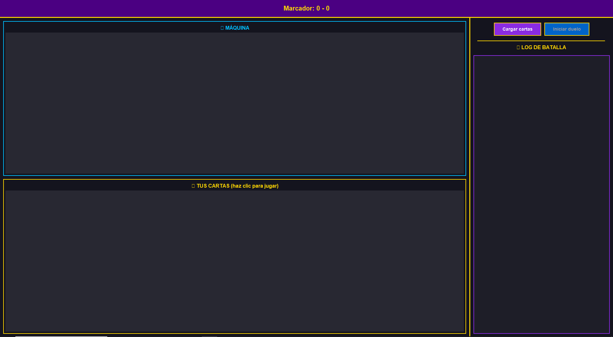
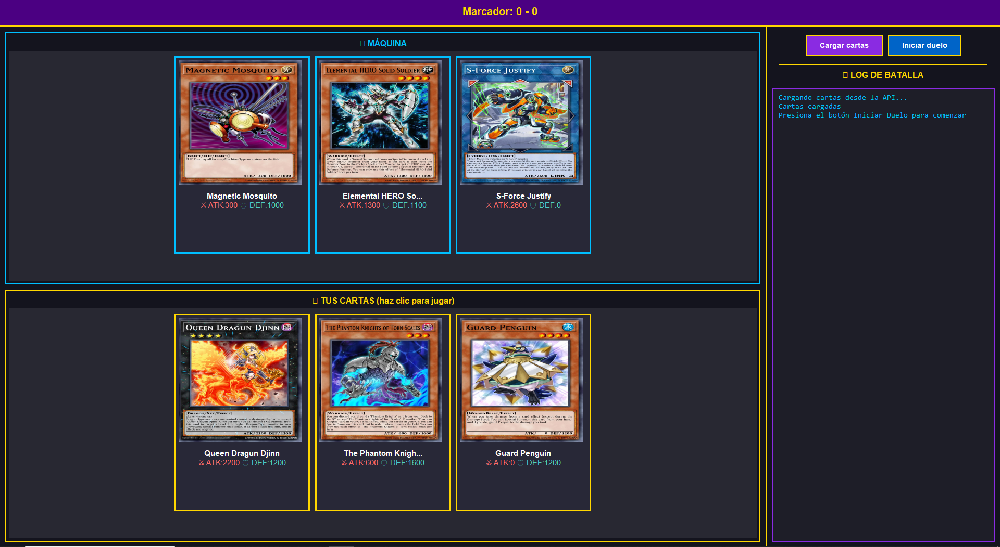
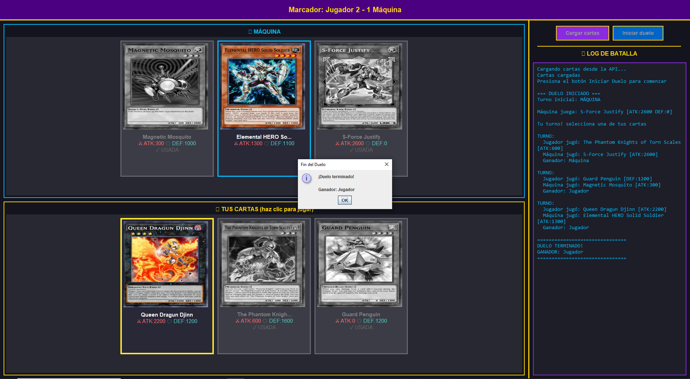

# Laboratorio 1

Mini-aplicación de escritorio en Java Swing que simula un duelo
sencillo de Yu-Gi-Oh! entre un jugador y la máquina, utilizando datos obtenidos en vivo
desde la API YGOProDeck.
Cada jugador tendrá 3 cartas Monster obtenidas aleatoriamente, con imagen y
atributos.
Por turnos, el jugador selecciona qué carta usar, mientras que la máquina elige la suya al
azar. En cada turno solo habrá una carta ganadora según sus stats. El primero que gane
2 de 3 rondas es el vencedor.

## 📋 Instrucciones de ejecución - cómo jugar

- Al ejecutar tendrás dos botones, Iniciar duelo y Cargar cartas, el botón Iniciar duelo está deshabilitado hasta que se carguen las cartas.
- El jugador y la máquina reciben 3 cartas aleatorias al inicio.
- Cuando termina la carga, puedes:
  - Iniciar duelo, o Cargar cartas nuevamente.
- Al Iniciar duelo, se decide aleatoriamente quién empieza si el jugador o la máquina.
- Cuando el jugador juega una carta la carta se establece en ATK o DEF aleatoriamente y la máquina también juega su carta y posición aleatoriamente.
- Se compara el valor efectivo es decir ATK si estás en ATK, DEF si estás en DEF y se decide el ganador de la ronda.
- Gana el duelo quien llegue primero a 2 victorias (BO 3)
- El duelo termina y se muestra un mensaje de ganador.
- Al Cargar cartas otra vez:
  - Se reinician el marcador y el log.
   - Las cartas usadas se muestran en gris con el texto USADA.

## Breve explicación del proyecto

La clase Duel gestiona la mecánica del duelo con los mazos, el puntaje y la resolución de rondas mientras que GameWindow sería la interfaz Swing, carga de las cartas, descarga de imágenes y responde a eventos implementando la interfaz BattleListener mientras que la clase Card representa las cartas con el nombre, ATK, DEF, y la imagen asi como la posición ya sea ATK o DEF usando la clase YgoApiClient la cual gestiona la API de YGOProDeck filtrando únicamente cartas Monster tambipen la interfaz BattleListener controla la lógica del duelo de la interfaz gráfica donde cada turno notifica jugadas, cambios de marcador y el fin del duelo.

## Estructura del Proyecto

```
src/main/java/yugioh/
├── api/
│   └── YgoApiClient.java       # Gestiona la API YGOProDeck
├── listener/
│   └── BattleListener.java     # Interfaz para los eventos
├── logic/
│   └── Duel.java               # Lógica y mecánica del duelo
├── model/
│   └── Card.java               # Modelo de datos de las cartas
└── ui/
    ├── GameWindow.java         # Interfaz gráfica Swing
    └── Main.java               # Punto de entrada
```
## Capturas de pantalla
### Pantalla principal

### Cartas cargadas

### Duelo terminado



## 👤 Autores

Carlos Mario Marín Duque
Andry Liseth Garcia

